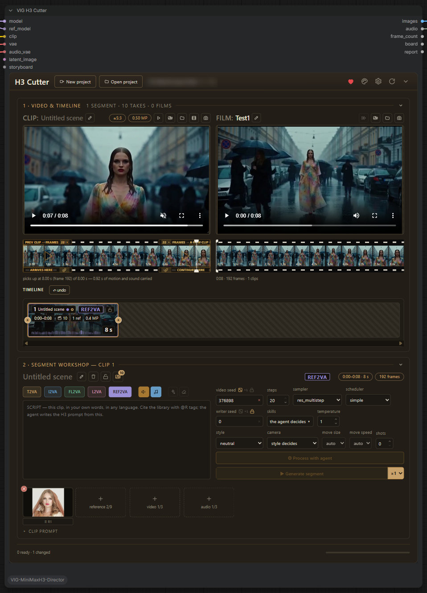
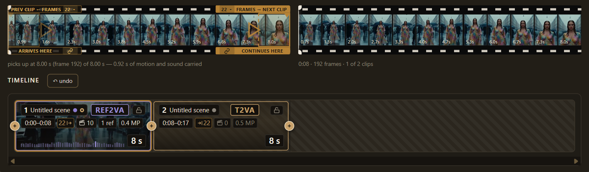
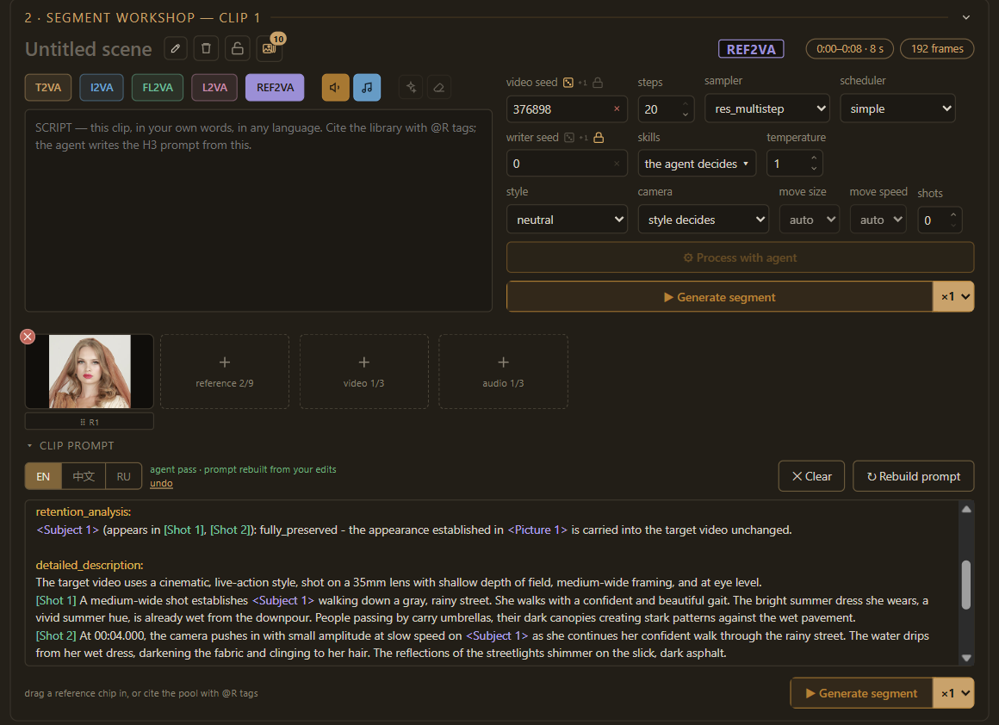
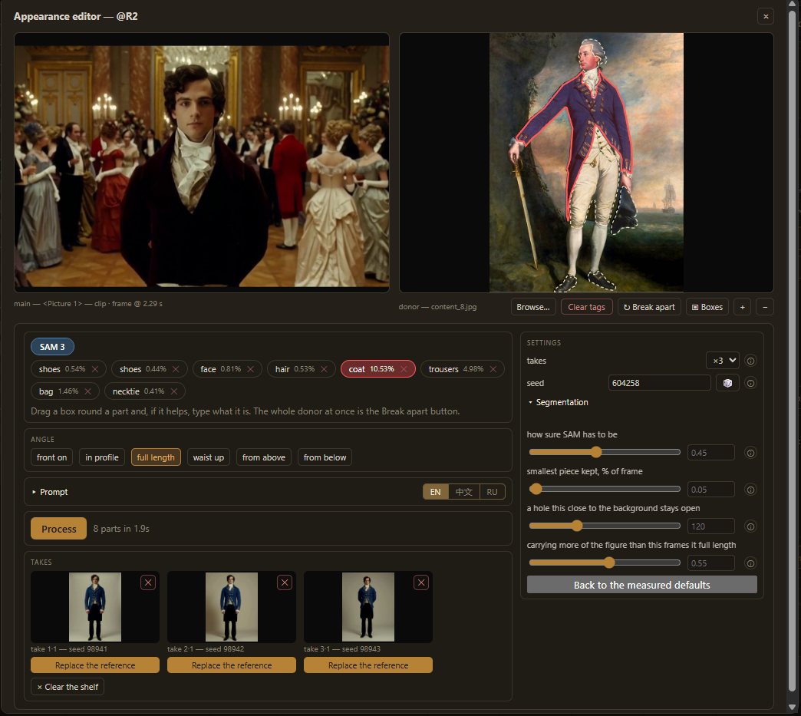
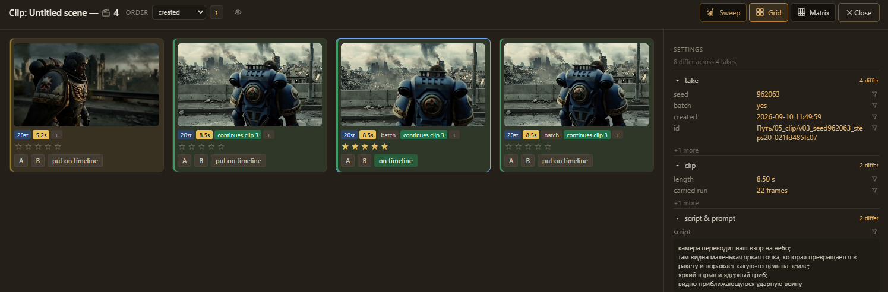
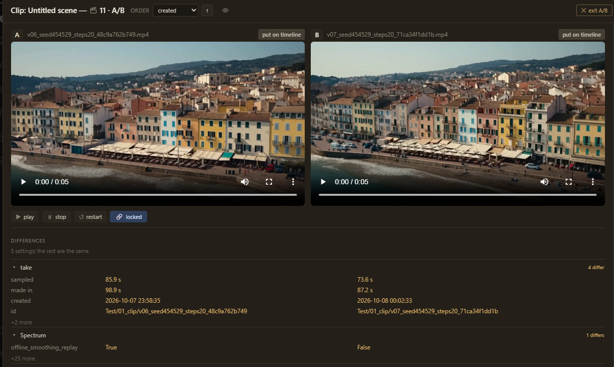
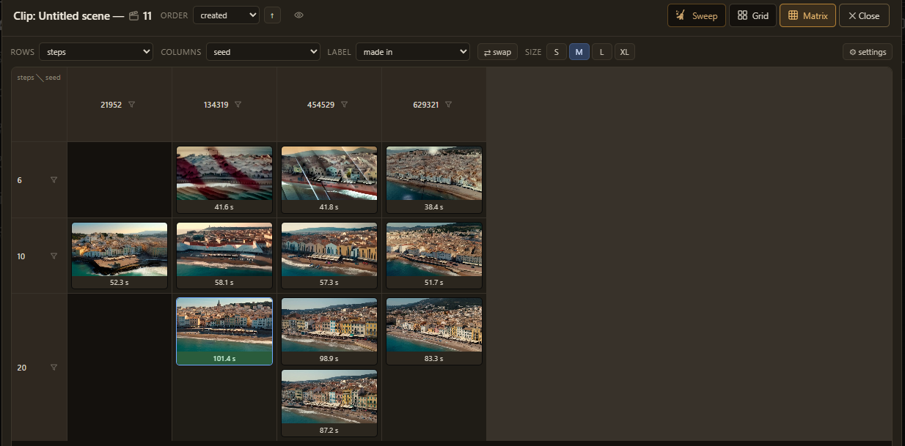
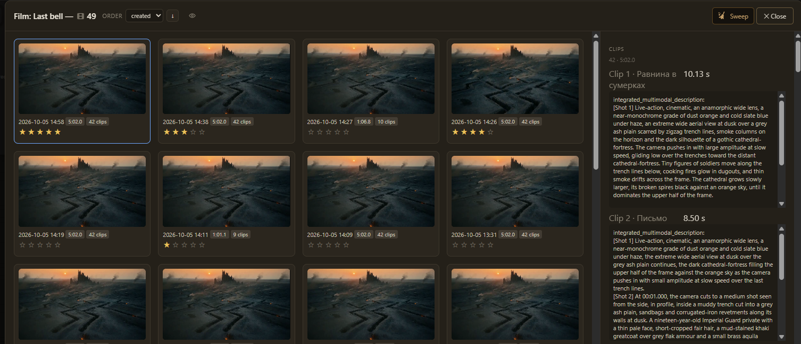

# (VIG) MiniMax H3 Director


**A video editing studio for MiniMax H3, inside one ComfyUI node.**

Write a film the way you would describe it — clip by clip, in your own words and
in any language — and the console turns each clip into a format-valid H3
prompt, renders it with picture and synchronized sound, carries motion and
sound from one clip into the next, and joins the clips into a film. Change one
clip and only that clip renders again.



If it saves you time, you can support its development on **[Ko-fi](https://ko-fi.com/vigpay)**.

---

## Contents

- [What it does](#what-it-does)
- [Requirements](#requirements)
- [Installation](#installation)
- [The writing model](#the-writing-model)
- [SageAttention — a faster sampler](#sageattention--a-faster-sampler)
- [Quick start](#quick-start)
- [The console](#the-console)
- [The reference editor](#the-reference-editor)
- [The takes and films galleries](#the-takes-and-films-galleries)
- [Whole films: Film Director and storyboard JSON](#whole-films-film-director-and-storyboard-json)
- [Projects](#projects)
- [Example workflows](#example-workflows)
- [How long a render takes](#how-long-a-render-takes)
- [Troubleshooting](#troubleshooting)
- [Support](#support)
- [License and credits](#license-and-credits)

---

## What it does

MiniMax H3 does not take free-form prompts. It expects a strict format —
fixed fields in a fixed order, `[Shot N] At MM:SS.mmm` markers on the clip's
real timings, speech inside `<d>[Language] …</d>`, references cited as
`<Picture 1>` — and a format mistake does not raise an error: it quietly makes
the video worse. Doing that by hand for one clip is slow; for a film of a dozen
clips that must share a cast, a clock and a soundtrack, it is hard.

This extension does it for you:

- **One clip, one workshop.** Write the clip's script in plain language, pick a
  mode, a style and a camera, attach references. The writing model turns it into
  a full H3 prompt; Python owns the structure, so even a weak model cannot
  produce a malformed prompt.
- **A timeline, not a graph.** Clips sit on a timeline you drag, trim, reorder
  and lock. The film joins itself, with its soundtrack.
- **Clips that continue each other.** A clip can carry the last frames *and
  the sound* of the one before it, so a cut plays as one recording instead of
  restarting from rest. A clip can also be built to *arrive* at the next one.
- **Every H3 mode.** T2VA (text), I2VA (first frame), FL2VA (first and last
  frame), L2VA (last frame) and REF2VA (up to 9 images, 3 videos and 3 audio
  references), each on the checkpoint it needs.
- **Re-render one clip, keep the rest.** Every clip is cached by what it is;
  an unchanged clip is never sampled twice.
- **Takes you can compare.** Every render is kept in your project folder;
  the takes gallery plays them side by side, rates them, lays them out in a
  matrix by any setting and puts the one you choose on the timeline.
- **A reference editor.** Crop a reference, carry a hairstyle or a costume from
  another photo onto it, re-shoot it from a named angle — with SAM 3 finding
  and naming the parts for you.
- **Whole films.** The Film Director node plans a film from one script with its
  cast and places fixed once; or hand the console a finished storyboard as JSON.
- **36 director style profiles** — from Kubrick, Wong Kar-wai and Miyazaki to
  film noir, found footage and claymation — and the camera vocabulary of the
  official H3 guide.

## Requirements

- **ComfyUI 0.32.0 or newer** (native MiniMax H3 support). Carrying motion and
  sound across cuts needs **0.33.5 or newer**; on older builds a clip opens on
  the previous clip's last frame instead, and the run report says so.
- **The MiniMax H3 models**, packaged for ComfyUI at
  [Comfy-Org/MiniMax-H3](https://huggingface.co/Comfy-Org/MiniMax-H3) — see
  [Models](#models) below.
- **An NVIDIA GPU.** It runs on a 12 GB card (developed on an RTX 4070 Ti);
  more VRAM and RAM make it faster.
- **For writing prompts:** a local GGUF model with llama.cpp, or any
  OpenAI-compatible server — see [The writing model](#the-writing-model). Not
  needed if you write prompts yourself or use a storyboard JSON.

## Installation

- **ComfyUI Manager** — search for **VIG** (or `vig-minimax-h3-director`) and
  press Install. Search for "MiniMax H3 Director" alone and other packs with
  similar names come first.
- **Comfy CLI** — `comfy node install vig-minimax-h3-director`
- **By hand** — clone into `ComfyUI/custom_nodes/` and install its one
  requirement (OpenCV) with the Python that runs ComfyUI:

  ```bash
  cd ComfyUI/custom_nodes
  git clone https://github.com/Weloyo/VIG-MiniMaxH3-Director
  ```

  ```bash
  python_embeded\python.exe -m pip install -r ComfyUI\custom_nodes\VIG-MiniMaxH3-Director\requirements.txt
  ```

  (That is the portable build's Python; for ComfyUI Desktop use
  `ComfyUI\.venv\Scripts\python.exe`.)
- **Manager → Install via Git URL** with
  `https://github.com/Weloyo/VIG-MiniMaxH3-Director` works too, but ComfyUI
  Manager 4.x turns that button off by default: set
  `allow_git_url_install = True` in the `[default]` section of
  `ComfyUI/user/__manager/config.ini` and restart first.

Restart ComfyUI. On the first start the extension downloads MiniMax's own H3
prompt-writing and style skills (~400 KB) from MiniMax's GitHub — see
[License and credits](#license-and-credits) for why they are not bundled.

Open one of the [example workflows](#example-workflows) — `05_cutter_console`
is the place to start — and pick your model files in the loaders.

### Models

Put each file in the folder shown, inside `ComfyUI/models/` (ComfyUI Desktop:
its shared `models` folder). Every example workflow lists the files it needs in
a **Models** note, and ComfyUI offers to download a missing one when the
workflow opens.

| File | Folder | Size | Role |
|---|---|---|---|
| [minimax_h3_fl2va_pruned_int8_convrot.safetensors](https://huggingface.co/Comfy-Org/MiniMax-H3/resolve/main/diffusion_models/minimax_h3_fl2va_pruned_int8_convrot.safetensors) | `diffusion_models` | 21 GB | base checkpoint → `model` (T2VA, I2VA, FL2VA, L2VA) |
| [minimax_h3_ref2va_pruned_int8_convrot.safetensors](https://huggingface.co/Comfy-Org/MiniMax-H3/resolve/main/diffusion_models/minimax_h3_ref2va_pruned_int8_convrot.safetensors) | `diffusion_models` | 21 GB | ref2va checkpoint → `ref_model` (REF2VA) |
| [qwen3vl_32b_minimax_h3_nvfp4_awq.safetensors](https://huggingface.co/Comfy-Org/MiniMax-H3/resolve/main/text_encoders/qwen3vl_32b_minimax_h3_nvfp4_awq.safetensors) | `text_encoders` | 15.7 GB | text encoder → `clip` |
| [minimax_h3_video_vae_fp16.safetensors](https://huggingface.co/Comfy-Org/MiniMax-H3/resolve/main/vae/minimax_h3_video_vae_fp16.safetensors) | `vae` | 5.2 GB | video VAE → `vae` |
| [minimax_h3_audio_vae_fp32.safetensors](https://huggingface.co/Comfy-Org/MiniMax-H3/resolve/main/vae/minimax_h3_audio_vae_fp32.safetensors) | `vae` | 0.6 GB | audio VAE → `audio_vae` |
| [minimax_h3_fl2v_turbo_4step_v1.1_768p_comfyui_bf16.safetensors](https://huggingface.co/lightx2v/Minimax-h3-Turbo/resolve/main/minimax_h3_fl2v_turbo_4step_v1.1_768p_comfyui_bf16.safetensors) | `loras` | 2 GB | Turbo LoRA, base model — only for examples 09/10 |
| [minimax_h3_ref2v_turbo_4step_v0.1_comfyui_bf16.safetensors](https://huggingface.co/Comfy-Org/MiniMax-H3/resolve/main/loras/minimax_h3_ref2v_turbo_4step_v0.1_comfyui_bf16.safetensors) | `loras` | 2 GB | Turbo LoRA, ref2va model — only for examples 09/10 |

**Less memory?** The same repository has `…_pruned_w6a8` checkpoints (16 GB
each) and `minimax_h3_video_vae_int8_convrot` (2.8 GB); pick them in the
loaders. The ref2va checkpoint is needed only for REF2VA clips.

**Optional:** SAM 3 for the reference editor —
[facebook/sam3](https://huggingface.co/facebook/sam3) (gated: request access)
into `models/sam3/`; a GGUF model and `llama-server` for the prompt writer —
see [The writing model](#the-writing-model).

## The writing model

The prompt writer is an agent that reads the official H3 guides and your
clip, writes the prompt, checks it against the format validator and repairs it.
It runs on:

- **Local (default)** — llama.cpp's `llama-server` with a GGUF model of your
  choice. The extension starts it when you press a writing button, keeps it
  loaded between presses, and puts it down the moment a render starts, so it
  never competes with H3 for the card.
- **External** — any OpenAI-compatible server you keep running (LM Studio,
  llama.cpp, a hosted provider).
- **Offline** — if no model is available, a plain template writer produces a
  structurally correct prompt, and the console says loudly that it did.

**Setting up the local writer:**

1. Download a llama.cpp release for your GPU from
   [ggml-org/llama.cpp](https://github.com/ggml-org/llama.cpp/releases) — on
   Windows with an NVIDIA card, the `bin-win-cuda` zip and its `cudart` zip —
   and unpack both into `ComfyUI/models/llama.cpp/`.
2. Put an instruction-tuned GGUF model in a folder of its own. A model with a
   vision projector (`mmproj-….gguf` beside it) lets the writer *look* at a
   clip's first frame and describe what is really there; a text-only model
   writes from the script alone.
3. In the console, press the **gear** in the header, choose that folder and the
   model.

The extension finds `llama-server` beside the model, in any models folder
ComfyUI knows (extra model paths and ComfyUI Desktop's shared folder included)
and on `PATH`. Models a few billion parameters in size (for example a Gemma 4
E4B) write well and fast; reasoning-heavy models can spend minutes thinking
before they answer.

## SageAttention — a faster sampler

SageAttention makes every sampling step faster (about 1.4x on an RTX 4070 Ti)
with no visible change to the picture. The accelerated example workflows
(`07`, `09`, `12`) apply it through
[KJNodes](https://github.com/kijai/ComfyUI-KJNodes). KJNodes only *applies*
it: the `sageattention` package itself must be installed into ComfyUI's
Python, and on Windows it cannot be installed by name — the right wheel depends
on your CUDA and torch versions. Without it KJNodes stops with
`No module named 'sageattention'` (or, for its MiniMax H3 patch,
"sageattention is not new enough version").

**This repository has an installer that works this out for you.** It lives
on GitHub only: the Comfy Registry does not allow an extension to install
packages itself, so an install through ComfyUI Manager does not include it.

1. Install KJNodes (ComfyUI Manager → *ComfyUI-KJNodes*).
2. **Close ComfyUI.**
3. Get the installer. If you cloned this repository it is already in
   `tools\`. Otherwise download
   [install_sageattention.bat](https://raw.githubusercontent.com/Weloyo/VIG-MiniMaxH3-Director/main/tools/install_sageattention.bat) and
   [install_sageattention.py](https://raw.githubusercontent.com/Weloyo/VIG-MiniMaxH3-Director/main/tools/install_sageattention.py) into
   `ComfyUI\custom_nodes\VIG-MiniMaxH3-Director\tools\` (create the
   `tools` folder if it is not there).
4. Double-click
   `ComfyUI\custom_nodes\VIG-MiniMaxH3-Director\tools\install_sageattention.bat`.
   It finds ComfyUI's own Python next to the extension — `python_embeded` for
   the portable build, `ComfyUI\.venv` for ComfyUI Desktop, `venv` for a manual
   install — and runs the installer with it.
5. The installer prints your Python, torch, CUDA and GPU, then installs:
   - **`triton-windows`** — the release matching your torch, from PyPI;
   - **SageAttention** — the prebuilt wheel for your CUDA and torch, from
     [woct0rdho/SageAttention](https://github.com/woct0rdho/SageAttention/releases);
   - **Python headers for Triton** — only if your Python lacks them.

   It finishes by running SageAttention on your GPU against PyTorch's own
   attention. **"Done"** means it works.
6. Start ComfyUI, open `07_quality_sage`, and set the Sage patch node's mode to
   **auto**. (`sageattn3` is for RTX 50xx Blackwell cards only.)

**From a terminal** — the same script, with options:

```bash
python tools\install_sageattention.py --dry-run
```

shows the plan and changes nothing; run it again without `--dry-run` to
install. Pass ComfyUI's folder or its `python.exe` if it is not found on its
own (`python tools\install_sageattention.py D:\ComfyUI_windows_portable`), and
add `--force` to replace a SageAttention built for another CUDA version.

Windows with an NVIDIA RTX 30xx or newer only. On Linux, install it with
`pip install sageattention` into ComfyUI's Python.

## Quick start

1. Load **`05_cutter_console.json`** and choose your H3 files in the loaders:
   base checkpoint → `model`, ref2va checkpoint → `ref_model`, the text encoder,
   the video and audio VAEs.
2. Press **New project** in the console's header and choose an empty folder.
   Everything you make is kept there.
3. Select clip 1 on the timeline. In the **segment workshop** below, write what
   happens in your own words, for example
   *"A woman in a red coat walks along a rainy night street, neon signs reflect
   in the puddles, she stops and looks up"*.
4. Pick a **mode** (T2VA for text only), a **style** and, if you like, a
   **camera** move.
5. Press **Process and generate**. The writer turns the script into an H3
   prompt (open *Clip prompt* to read it), then the clip renders. The live
   preview plays in the clip player while it samples.
6. Add a clip with the gold **+** on the timeline, write its script, and on the
   clip film strip drag the gold band to carry motion from the clip before.
   Render it — the film player now plays both, joined.

## The console

The node draws its own interface: a header, the players and timeline, and the
workshop for the selected clip.

### Header

**New project** and **Open project**, the project folder and its size (click
the name to open it in Explorer). On the right: **♥** support, the **colour
scheme** (six themes, light included), the **gear** with the machine settings
— the writing model and its folder, temperature, the live preview's resolution
and decoder — **refresh** and **collapse**.

### 1 · Video & timeline



- **Two players.** The selected clip and the whole film, each with its own name
  and presses: render this clip again, its takes gallery and folder, load a
  video file as the clip, send the paused frame to the reference library; over
  the film, **render the rest** (every clip still without a take, in order),
  the films gallery and folder. An eye on each player covers the picture.
- **Canvas.** The shape and megapixel pills over the clip player set the frame.
  The megapixel menu shows what a step will cost at each size, measured on
  *your* machine. The shape is fixed once the first clip has rendered — every
  clip after it continues the one before.
- **The clip film strip** shows the clip frame by frame. Its gold bands are how
  clips connect: **continues here** marks where the next clip picks up and how
  many frames (5, 22, 39 or 56) and how much sound it carries; **arrives here**
  builds the clip before so that it ends exactly on this one.
- **The timeline.** Each card shows the clip's mode, lock, timecode, how motion
  flows in and out, how many takes it has, its references and resolution, and
  the waveform of its real sound. Drag an edge to change the length, drag a card
  to reorder, use the gold circles to insert, **undo** any edit. A **locked**
  clip is settled: nothing renders, moves or deletes it.

### 2 · Segment workshop



Everything about one clip:

- **Header** — the clip's name, delete, lock, its takes gallery (with the
  number of takes), and the facts: mode, length, frames, shape, megapixels.
- **Script** — your own words, any language. `@R1` cites a reference from the
  library. Above it: the five **modes**, **sound** (muted at the join, the take
  keeps it) and **music** (written into the prompt or not), **Enrich script**,
  **Clear**.
- **Settings**, in three rows:
  - *render* — the clip's video seed with its mode (random / +1 / fixed),
    steps, sampler, scheduler;
  - *writer* — the writer's seed, which **skills** it may read, temperature;
  - *look* — the director **style**, the **camera** move with its size and
    speed, and how many **shots** the clip may have.
- **Process with agent** writes the prompt. **Process and generate** writes it
  and renders — and becomes **Generate segment** when the prompt is already
  current, so no writing pass is spent on a prompt that would not change. The
  number welded to its side is how many takes one press makes. Both fill as
  they work.
- **Frames and references** — the first/last frame slots and the reference
  galleries for REF2VA. On a reference tile: remove, replace, **✦ edit
  appearance** (the reference editor) and take the video's shape from the
  picture. A small reference is enlarged before H3 sees it, so its detail is
  not lost.
- **Clip prompt** — the finished H3 prompt, editable. Its language switch
  (EN / 中文 / RU) translates it while protecting every format marker, so you
  can read and edit it in Russian and go back without a rewrite.

### Live preview and cost

While a clip samples, the clip player shows it forming, step by step — decoded
with a tiny VAE (`taeh3`, through KJNodes, if you have it) or a fast colour
approximation. The status line gives the step, the percentage and the estimated
time, from measurements of your own machine.

## The reference editor



Press **✦** on a reference tile. The editor composes **one** picture to use as
a reference — because H3 renders every person it is shown, handing it two
photos (a face and a hairstyle) makes two people.

- **Main picture** — the identity. Crop it, zoom with the wheel, pan with the
  middle button.
- **Donor** — any photo, from the file dialog. **Break apart** finds and names
  its parts (hair, beard, necktie, suit…) with **SAM 3**; or drag a rectangle,
  optionally with a word ("necktie"), or click a part. **+** adds to a
  selection, **−** takes a piece out. Each part shows its exact outline.
- **Angle** — front on, in profile, full length, waist up, from above, from
  below. Pick one before Process; pressing the lit one clears it.
- **Process** — the writer looks at both pictures and writes the transfer
  prompt; H3 renders image takes at a portrait resolution. The Cancel button
  fills as it works, and the job carries on if you close the editor — reopen it
  and it picks up where it is.
- **Replace the reference** on a take makes it the reference everywhere it is
  cited.

Segmentation runs on **SAM 3** — download `facebook/sam3` from Hugging Face
(a gated repository: request access with your account first) into
`ComfyUI/models/sam3`. SAM 2 is used for single clicks when both its checkpoint and
the `sam2` package are installed.

## The takes and films galleries



Every render of a clip is a **take**, kept in the project folder. The gallery
shows them all:

- play on hover, full size with sound, rate with stars, **put on timeline**;
- **A/B** — two takes side by side (see below);
- **filters** on any setting a take was made with, an order picker (created,
  length, render time, rating), a broom that sweeps takes by rating (with a dry
  run first), and an eye that covers every picture;
- the side column lists what the focused take was rendered with — sampler,
  models, LoRAs, accelerators, the writer and its seed — differences first.

### A/B: what one setting actually did



Press **A** on one card and **B** on another, and the sheet becomes a
comparison of the two:

- **one transport for both** — play, stop and restart from frame zero together;
- **locked to one instant** — with the lock on (the default), scrubbing either
  window moves the other to the same frame, so you compare the very moment you
  care about, not frame zero. Unlock it to read two takes at different points;
- **put on timeline** on either side, and the eye covers both at once;
- **the differences, and only those** — underneath, every setting the two takes
  differ by, grouped (the take, the model, each accelerator, the writer), with
  what each render cost in seconds. Everything they share is folded behind
  "+N more".

This is the fastest way to answer "did that change help?". Fix the seed, change
one thing — steps, an accelerator flag, a LoRA strength, the prompt — render
again, and put the two takes side by side. In the screenshot above, the same
seed and 20 steps, Spectrum's `offline_smoothing_replay` on against off: the
table names that one flag and shows that turning it off saved 12 s of sampling,
and the two windows show what it cost the picture.

Leave A/B with **exit A/B**, or drop one side by its own label to keep the
other and pick a new partner.

### Matrix: many takes on two axes



**Matrix** lays the takes out on two axes — say seed by steps, with the render
time on each — and picks those axes itself from what varies. A header becomes a
filter in one press. Hover a cell for its **A** and **B** buttons: the matrix
is where you find the pair worth comparing, and leaving the comparison brings
you back to it.

The **films gallery** (over the film player) keeps every film the project has
joined from more than one clip, with which clips, how long, and what each said.



## Whole films: Film Director and storyboard JSON

A film has a cast; a clip does not. Written clip by clip, the woman in clip 2
and the woman in clip 5 are strangers who happen to be described alike — and H3
renders a re-worded description as a different person.

**VIG H3 Film Director** takes a whole film's script (or a video to describe)
and produces a **storyboard**: the beats, the **cast** and the **places**
fixed once for the whole film, every beat's prompt written knowing the one
before. Wire it into the Cutter's last input; the first Run lays out the
timeline, the second renders it. A storyboard is applied once, so your later
edits are never overwritten.

**VIG H3 Storyboard (JSON)** takes a storyboard you (or an AI assistant) wrote
as JSON — every clip's length, mode, motion carry, references and finished
prompt — and lays it out with no writer at all. The node checks the whole file
before it lays anything out and names every problem it finds. A new storyboard
laid over a film in progress updates only the clips that are not shot yet.

## Projects

A project is a folder you choose, readable without this extension:

```
my_film/
  board.json          the timeline as of the last run
  clips/01_name/      every take of the clip, its prompts and frames
  film/               every joined film, with a record of its clips
  storyboard/         the plans the cut was laid out from
  workflow.json       the graph as drawn (opens in ComfyUI)
```

**Open project** loads a cut from any state — files moved or a render cache
cleared included: takes come back from the folder, posters are taken again and
the film is re-joined from the clips on the timeline. The render cache
(`output/vig_h3_cutter/`) is separate and only saves work; the project folder
is yours and keeps everything.

## Example workflows

Found under the extension's `example_workflows` folder (and in ComfyUI's
template browser under custom nodes).

**Plain — run on any ComfyUI with the H3 models:**

| File | Shows |
|---|---|
| `05_cutter_console.json` | The whole studio: both checkpoints wired, per-clip work end to end. **Start here.** |
| `06_cutter_canvas_from_latent.json` | The canvas set by an Empty Latent Image node |
| `11_film_director.json` | A whole film: the Film Director plans it, the Cutter renders it (press Run twice) |

**Accelerated — the same console with a faster sampler:**

| File | Shows | Needs |
|---|---|---|
| `07_quality_sage.json` | 20 steps + SageAttention — full quality, faster | KJNodes + [SageAttention](#sageattention--a-faster-sampler) |
| `08_quality_sol.json` | 20 steps + Sol-Attn | [ComfyUI-SolAttn_triton](https://github.com/DrBearJew/ComfyUI-SolAttn_triton) |
| `09_fast_sage.json` | 4 steps (Turbo LoRA) + SageAttention | KJNodes + SageAttention + the H3 Turbo LoRAs |
| `10_fast_sol.json` | 4 steps (Turbo LoRA) + Sol-Attn | ComfyUI-SolAttn_triton + the H3 Turbo LoRAs |
| `12_quality_sage_spectrum.json` | 07 plus Spectrum: about half the transformer passes, full-quality sound | KJNodes + SageAttention + [Spectrum MiniMax H3](https://github.com/xmarre/ComfyUI-Spectrum-MiniMax-H3) |

The 4-step modes are for judging the picture and the cut — their sound is
audibly worse. Render the takes you will listen to on 07, 08 or 12.

**Post:**

| File | Shows | Needs |
|---|---|---|
| `13_rtx_upscale.json` | A finished clip upscaled with NVIDIA Video Super Resolution, sound kept | [NVIDIA RTX Nodes](https://github.com/Comfy-Org/Nvidia_RTX_Nodes_ComfyUI), [VideoHelperSuite](https://github.com/Kosinkadink/ComfyUI-VideoHelperSuite) |

Every example carries a note on the canvas explaining it.

## How long a render takes

H3 renders on a grid of `17k+5` frames at 24 fps, so a clip's length snaps up
to the next legal count (4 s → 4.46 s, 5 s → 5.17 s, 8 s → 8.00 s); the
timeline shows both numbers. The cost of each sampling step grows with the
number of tokens — frames × width/16 × height/16 — roughly with its square.

Measured on an RTX 4070 Ti (12 GB), 20 steps:

| Clip | Accelerator | Per step |
|---|---|---|
| 832×480, 4.46 s | SageAttention | ~4.6 s |
| 832×480, 4.46 s | SageAttention + Spectrum | ~2.3 s |
| 832×480, 8 s | none | ~17 s |
| 1344×768, 8 s | none | ~100 s |

Twice the tokens cost about three and a half times the time.

**Carrying motion costs time too:** a carried run makes the clip's sequence
longer (a 22-frame carry is about 1.6x a clip's sampling). Free VRAM matters as
much as anything: close GPU-hungry programs before long renders.

## Troubleshooting

| Symptom | Cause and fix |
|---|---|
| `No module named 'sageattention'` / "not new enough version" in a Sage node | The package is not installed — run [the installer](#sageattention--a-faster-sampler). |
| "written OFFLINE (mechanical floor)" | No writing model could start. The message says why: no `llama-server` found, the model did not fit, or the server exited (its first error is quoted). |
| The writer takes minutes | A reasoning model is thinking, or the model did not fit in VRAM and runs on the CPU (the report says so). Use a smaller model or free the card. |
| The takes gallery asks for a folder | Takes are kept in a project folder. Choose one — the cut on screen is kept. |
| A clip "cannot open on" the one before | The clip in front has no take yet. Render it first; the console offers to render both. |
| A REF2VA face looks unlike the reference | Faces need room: a face that is 50 px wide in the frame cannot carry a likeness. Use closer framing or a larger canvas, and a reference where the face is large. |
| MiniMax skills "not downloaded yet" | The first-start download failed (no network). It retries on the next start. |

The console keeps a run report for every render — open it under the timeline;
it names what happened to every clip and why.

## Support

This extension is built and maintained by one person. If it is useful to you,
a donation keeps it going: **[ko-fi.com/vigpay](https://ko-fi.com/vigpay)** —
through PayPal, or a card through PayPal where your country allows it. The ♥ in
the console's header opens the same page. Direct PayPal works too:
[paypal.me/vigpay](https://paypal.me/vigpay).

Issues and ideas: [github.com/Weloyo/VIG-MiniMaxH3-Director/issues](https://github.com/Weloyo/VIG-MiniMaxH3-Director/issues).
The code here is a release build; development happens in a separate repository,
so a pull request is ported there by hand.

## License and credits

This extension's own code is licensed under the **GNU General Public License
v3.0** — see [LICENSE](LICENSE).

**Powered by MiniMax H3.** The model, its prompt format and its skills are
MiniMax's: [MiniMax-AI/MiniMax-H3](https://github.com/MiniMax-AI/MiniMax-H3) and
[MiniMaxAI/MiniMax-H3](https://huggingface.co/MiniMaxAI/MiniMax-H3), under the
MiniMax H3 Community License, which governs how the model and what it makes may
be used — including where. Read it before you render with it. MiniMax's skills
and guides are **not included** in this repository: on its first start the
extension downloads them from MiniMax's own GitHub, at the commit it was
written against, into ComfyUI's user directory.

Carrying motion and sound across a cut follows the method and grid arithmetic of
[ComfyUI-H3-Motion-Context](https://github.com/NikoDemon80/ComfyUI-H3-Motion-Context).
The live preview's tiny VAE loader is borrowed from
[KJNodes](https://github.com/kijai/ComfyUI-KJNodes). Segmentation in the
reference editor is Meta's [SAM 3](https://huggingface.co/facebook/sam3) and
[SAM 2](https://github.com/facebookresearch/sam2).
